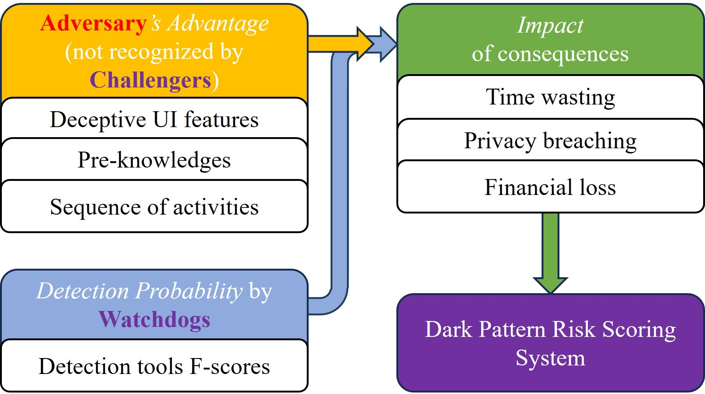
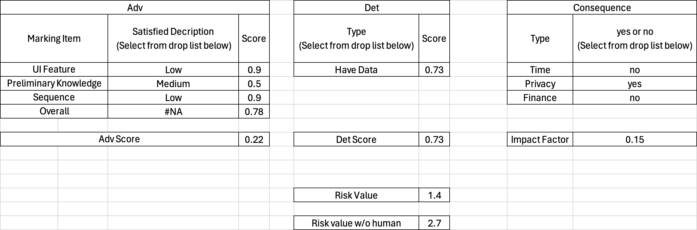

# The Invisible Game on the Internet: A Case Study of Decoding Deceptive Patterns

This is the official repository for the paper titled "The Invisible Game on the Internet:
A Case Study of Decoding Deceptive Patterns" which was published at the International World Wide Web Conference 2024 (known as WWW, A* Conference ranked by [CORE](https://portal.core.edu.au/conf-ranks/)).

In this repository, we provide an Excel spreadsheet that can calculate the risk value by filling in all the features of a given example.


If you have any questions, feel free to submit an issue or email me by zewei.shi@data61.csiro.au


Note: More Case Study will be released soon...


## Introduction

### Deceptive(Dark) Pattern

Deceptive(Dark) Pattern is an interface maliciously crafted to deceive users into perform actions they **<u>did not</u>** mean to do (Di Geronimo et al., 2020).

Clearly: Deceptive(Dark) pattern is trick user into doing things that are **<u>not</u>** in their interest (Chen et al., 2023).


### Security Game Concept: Adversary, WatchDog and Challengers



* Adversary: The web or mobile software that containd Deceptive Pattern

* WatchDog: Dark Pattern Detection Model

* Challenger: User

	

## Contribution

* We propose a new approach to decode and understand the threats introduced by deceptive patterns within a security game context, which innovatively involves the Adversary, Watchdog (e.g., detection tools), and Challengers (e.g., users) to build up a comprehensive threat model. 

* Based on the deceptive pattern game, we next introduce a quantitative approach to assess the risk of a specific deceptive pattern implementation, taking the interactions between the adversary, watchdog, and challengers into account while incorporating the impact of a deceptive pattern's consequence as well.
* We applied the proposed risk scoring system to various deceptive pattern categories. To demonstrate the practicability of the system, we report several representative cases with detailed analyses of their risk levels and potential consequences. We further showcased the necessity of involving the human factors in deceptive pattern risk assessment.


## Explain for each term

* Adv: 

	Human can not detect: The higher value, the more difficult for human to detect.

	*  Deceptive UI Features
		* High : UI contain high-risky deceptive features that could mislead or fool a user
		* Medium : UI contain medium-risky deceptive features that could mislead or fool a user
		* Low : UI contain no-risky or low-risky deceptive features that could mislead or fool a user

	* Pre-Knowledges
		* High: No preliminary knowledges needed
		* Medium: Some people need the preliminary knowledges
		* Low: Lots of people need the preliminary knowledges

	* Sequence of activities
		* High: Invloved dynamic multiple steps
		* Medium: Invloved dynamic two steps
		* Low: Static (A Single image)

* Det: 

	Model can detect: The higher value, the easier for model to detect

	* Hard to detect
	* Easy to detect
	* Have data: There is an accurate value from the SOTA model

* Impact factor:  (True or False Question)

	Measure how serious the consequences are

	* Time: Will user's time be wasted?
	* Privacy: Will user's privacy data be leaked?
	* Finance: WIll user's money be lost?


## An example

In this section, let's take the screenshot below, a case of Privacy Zuckring, as an example, and analyze each criterion one by one.


In the figure, there are several buttons set to "On" by default and a highlighted text "Always Active", we consider that the UI has provided information to users to help them recognize that there are several cookies required by the service provider, or at least their information might be collected if they click the bottom banner "Confirm My Choices''. Therefore, we rate **<u>UI_Feature risk</u>** as **<u>low</u>** and **<u>pre-knowledge risks</u>** as **<u>medium</u>** (the user may need some basic privacy knowledge to recognize the trick). The deceptive pattern here is implemented with a static UI, thus we rate the **<u>Sequence risk</u>** as **<u>low</u>**. These factors result in an **<u>adv score of 0.22</u>**, a quite low advantage score as such deceptive pattern implementation is not hard to be identified by a human user.

Meanwhile, as reported by UIGuard (Chen et al., 2023), an on-the-shelf detection tool, can **<u>achieve 0.73 F-Score</u>** on Privacy Zuckering deceptive patterns, which is a relatively high performance, comparing to other more complex patterns. We believe that such a good detection performance may related to the detection of specific UI widges and the descriptions of forced actions as they are typical and easy to identify. 

The consequence of this deceptive pattern case obviously links to **<u>privacy breach</u>** as cookies are often used for advertising to track user behavior on websites. 

Fill all information in our spread sheet, the risk score for this Privacy Zuckering case is calculated as **<u>1.4</u>**, which is considered a low-level risk.




## Reference

* Geronimo, et al.. 2020. Ui dark patterns and where to find them: A study on mobile applications and user perception.

* Chen, et al.. 2023. Unveiling the tricks: Automated detection of dark patterns in mobile applications.


## Citing Our Work

If you find our work is beneficial, please cite our work:
```
@misc{shi2024invisible,
      title={The Invisible Game on the Internet: A Case Study of Decoding Deceptive Patterns}, 
      author={Zewei Shi and Ruoxi Sun and Jieshan Chen and Jiamou Sun and Minhui Xue},
      year={2024},
      eprint={2402.03569},
      archivePrefix={arXiv},
      primaryClass={cs.CR}
}
```